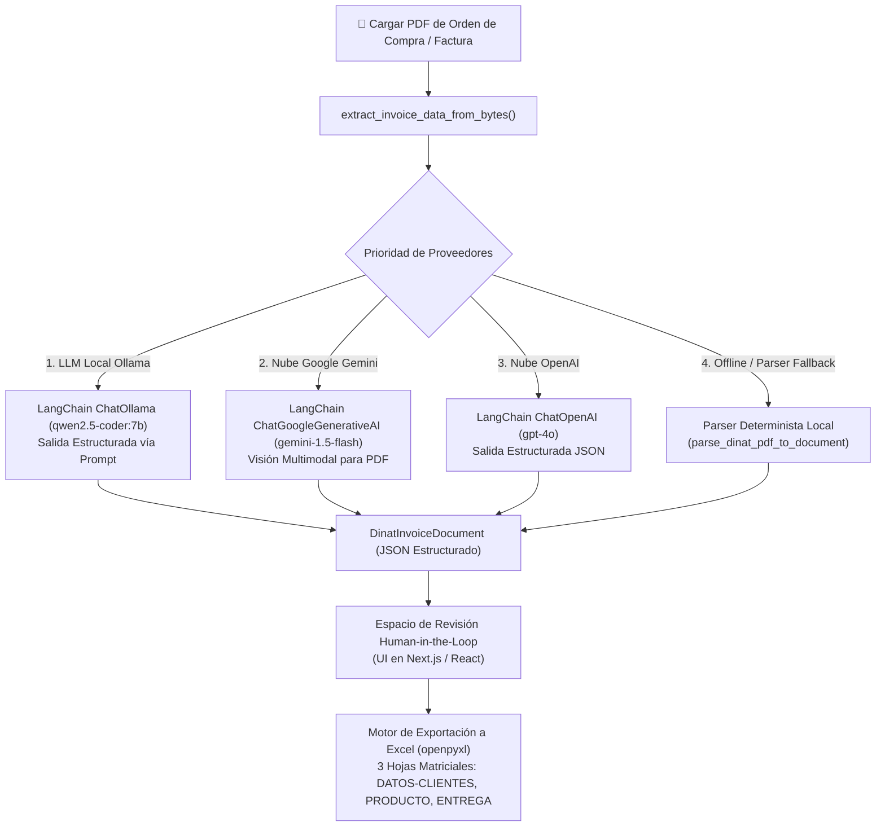

# Aplicación de Escritorio para Extracción de Datos de Facturas y Órdenes de Compra en PDF

Una aplicación de escritorio empresarial para extraer datos estructurados de órdenes de compra y facturas en formato PDF utilizando Modelos de Lenguaje Locales y Multimodales (**LangChain + Ollama Qwen 2.5 Coder / Google Gemini / OpenAI / Parser Determinista Local**), permitiendo la revisión y edición de datos en un entorno interactivo *Human-in-the-Loop* y generando o anexando registros en archivos Excel (`.xlsx`).

---

## 🏗️ Arquitectura y Motor Multi-LLM

El sistema cuenta con una arquitectura flexible y multiproveedor gestionada a través de **LangChain** y esquemas estructurados de **Pydantic**:



### Motores de Extracción Compatibles:
1. **Ollama Local (Recomendado por Privacidad y Costo Cero)**: Impulsado por `langchain-ollama` ejecutando `qwen2.5-coder:7b`. Inferencia local de alta velocidad sin costos por tokens ni dependencias de servicios externos en la nube.
2. **Google Gemini (Multimodal en la Nube)**: Impulsado por `langchain-google-genai` (`gemini-1.5-flash`) para análisis visual y multimodal directo de documentos PDF.
3. **OpenAI (LLM en la Nube)**: Impulsado por `langchain-openai` (`gpt-4o`) con validación estricta de esquemas JSON mediante Pydantic.
4. **Respaldo Determinista Local**: Un analizador basado en reglas y expresiones regulares ultrarrápido, sin dependencias externas, ideal para ejecución fuera de línea y pruebas unitarias en CI.

### 🔄 Detección Dinámica del Motor LLM y Verificación de Estado (*Health Check*):
El backend expone un endpoint de verificación en tiempo de ejecución (`GET /health`) que inspecciona las variables de entorno activas y devuelve el modelo exacto en uso. El frontend en Next.js consulta automáticamente este endpoint al iniciar y muestra el estado en vivo (ej. `Qwen 2.5 Coder 7B (Ollama)`, `Gemini 1.5 Flash` o `GPT-4o`) directamente en la cabecera.

---

## 🛠️ Stack Tecnológico

- **Backend**: Python 3.10+, FastAPI, LangChain, `langchain-ollama`, `langchain-google-genai`, `langchain-openai`, Pydantic V2, OpenPyXL, PyPDF
- **Frontend**: Next.js 14, React 18, Tailwind CSS, Lucide Icons
- **Contenedor de Escritorio**: Electron (o ejecución estándar en navegador local)
- **Motor de IA Local**: Ollama (`qwen2.5-coder:7b`)
- **Pruebas Automatizadas**: Pytest (Suite completa con pruebas unitarias, API, exportador a Excel y pruebas de inferencia en vivo con Ollama)

---

## 📋 Requisitos Previos

Antes de ejecutar la aplicación, asegúrate de tener instalado lo siguiente en tu equipo:

1. **Python 3.10+** (Verificar con `python --version`)
2. **Node.js 18+ o 20+** (Verificar con `node --version`)
3. **Git**
4. **Ollama** (Opcional para IA local, descargar desde [ollama.com](https://ollama.com))

---

## 🚀 Cómo Ejecutar la Aplicación (Entorno Local)

Para ejecutar la aplicación completa localmente, abre **dos ventanas de terminal independientes** (o tres si deseas iniciar Electron).

### Terminal 1: Backend en Python (FastAPI)

```bash
# 1. Navegar al directorio del backend
cd c:\dev\agentic\backend

# 2. Crear un entorno virtual (opcional pero recomendado)
python -m venv venv

# 3. Activar el entorno virtual (Windows PowerShell)
.\venv\Scripts\Activate.ps1

# (En Linux / macOS usar: source venv/bin/activate)

# 4. Instalar dependencias del backend
pip install -r requirements.txt

# 5. Iniciar el servidor backend de FastAPI
python main.py
```

> **URL del Servidor API**: `http://localhost:8000`  
> **Documentación Interactiva Swagger**: `http://localhost:8000/docs`

---

### Terminal 2: Frontend en Next.js / React

```bash
# 1. Navegar al directorio del frontend
cd c:\dev\agentic\frontend

# 2. Instalar dependencias del frontend
npm install

# 3. Iniciar el servidor de desarrollo de Next.js
npm run dev
```

> **URL de la Aplicación Web**: `http://localhost:3000`

---

### Terminal 3 (Opcional): Contenedor de Escritorio Electron

```bash
# Navegar a la raíz del proyecto
cd c:\dev\agentic

# Iniciar Electron (requiere Terminal 1 y Terminal 2 en ejecución)
npx electron electron/main.js
```

---

## 🔑 Configuración de Proveedores LLM (`backend/.env`)

Crea un archivo `.env` dentro de la carpeta `backend/` para configurar tu proveedor de IA preferido:

### Opción 1: Ollama Local (Qwen 2.5 Coder 7B) - *Recomendado*
1. Descargar el modelo en Ollama:
   ```bash
   ollama run qwen2.5-coder:7b
   ```
2. Configurar `backend/.env`:
   ```env
   USE_OLLAMA=true
   OLLAMA_MODEL=qwen2.5-coder:7b
   OLLAMA_BASE_URL=http://localhost:11434
   ```

### Opción 2: Google Gemini (Nube Multimodal)
```env
GEMINI_API_KEY=tu_api_key_de_gemini_aqui
```

### Opción 3: OpenAI (Nube)
```env
OPENAI_API_KEY=tu_api_key_de_openai_aqui
```

### Opción 4: Modo Local Determinista
Si no se configuran variables de entorno para modelos externos, la aplicación se ejecutará de forma automática en modo determinista local con cero dependencias de red.

---

## 📦 Compatibilidad Multi-Marca y Plantillas

El motor de extracción procesa órdenes de compra y facturas en PDF de diferentes marcas y estructuras:
- **Marcas Soportadas**: Naturas, La Granja, Raptor, Mountain Dew, Del Prado y plantillas generales de Dinat.
- **Extracción de Encabezados y Horarios**: Captura `Hora de llegada`, `Hora de finalización`, `Fecha de emisión`, `Fecha de entrega`, RTN del proveedor y número de orden.
- **Geolocalización y Metadatos del Cliente**: Detecta automáticamente nombres de clientes, códigos de tienda, direcciones y coordenadas de latitud/longitud.
- **Detalle de Productos y Recálculo**: Análisis tabular de cantidades, unidades, descripciones, precios unitarios, descuentos y totales de línea, con recálculo automático de impuestos (ISV 15%).

---

## 🧪 Ejecución de Pruebas Automatizadas

### 1. Ejecutar Suite Estándar con Pytest en el Backend
Ejecuta todas las pruebas unitarias, de API, del exportador a Excel y de extracción sobre los archivos de `archivos_prueba/`:
```bash
cd c:\dev\agentic
python -m pytest backend/tests/test_api.py backend/tests/test_exporter.py backend/tests/test_extractor_langchain.py backend/tests/test_archivos_prueba.py -v
```

### 2. Ejecutar Pruebas de Extracción en Vivo con Ollama
Evalúa la extracción directamente contra la instancia local de Ollama con `qwen2.5-coder:7b`:
```bash
python -m pytest backend/tests/test_ollama_extractor.py -v
```

### 3. Validar Compilación de Producción del Frontend (Next.js)
```bash
cd c:\dev\agentic\frontend
npm run build
```

---

## 📖 Guía de Uso de la Aplicación

1. **Paso 1: Cargar PDF (`1. Cargar PDF`)**:
   - Arrastra y suelta un archivo PDF de orden de compra o factura en el área indicada, o haz clic en **Seleccionar archivo**.
   - El sistema valida la estructura del archivo e inicia el proceso de extracción según el motor configurado.

2. **Paso 2: Revisión Human-in-the-Loop (`3. Revisar y editar datos`)**:
   - Inspecciona y modifica los datos extraídos a lo largo de las 6 secciones colapsables del documento:
     - **Encabezado y Datos del Proveedor** (Nº Orden, Fecha Emisión, RTN Proveedor, Marca)
     - **Datos del Cliente y Geolocalización** (Nombre Cliente, Código Tienda, Coordenadas Lat/Long)
     - **Detalle de Productos** (Tabla editable de productos con recálculo dinámico de totales)
     - **Resumen y Totales Financieros** (Subtotal gravable, 15% ISV, Total general)
     - **Transporte y Logística** (Nombre de conductor, ID de empleado, Placa de vehículo)
     - **Firmas y Autorizaciones** (Despachado por, Recibido por, Autorizado por)
   - Haz clic en **Ver JSON** para inspeccionar o copiar la estructura en formato JSON.
   - Haz clic en **Validar datos** una vez terminada la revisión.

3. **Paso 3: Listo para Producción (`2. Listo para producción`)**:
   - Revisa el resumen final del documento validado.
   - Establece la ruta de destino del archivo Excel (`.xlsx`).
   - Elige la acción de producción:
     - **Append (agregar al final)**: Agrega las nuevas filas a las hojas correspondientes de un Excel existente.
     - **Crear nuevo archivo**: Genera un archivo Excel nuevo con el formato de las matrices estructuradas.
   - Haz clic en **Confirmar y generar Excel** para guardar los datos.

---

## 📝 Historial de Cambios y Actualizaciones Recientes

- **feat(ui)**: Detección dinámica del modelo LLM activo y banner de estado en tiempo real consultando `/health`.
- **feat(extractor)**: Soporte completo para Ollama local (`qwen2.5-coder:7b`) con salida estructurada mediante esquemas Pydantic.
- **feat(multi-brand)**: Mayor precisión en la extracción de múltiples marcas (Naturas, La Granja, Raptor, Mountain Dew), marcas de tiempo (`Hora de llegada`/`Hora de finalización`) y coordenadas geográficas.
- **test**: Suite integral de pruebas automatizadas para API, Exportador Excel, Extractor LangChain, documentos PDF de prueba e inferencia en vivo con Ollama.
