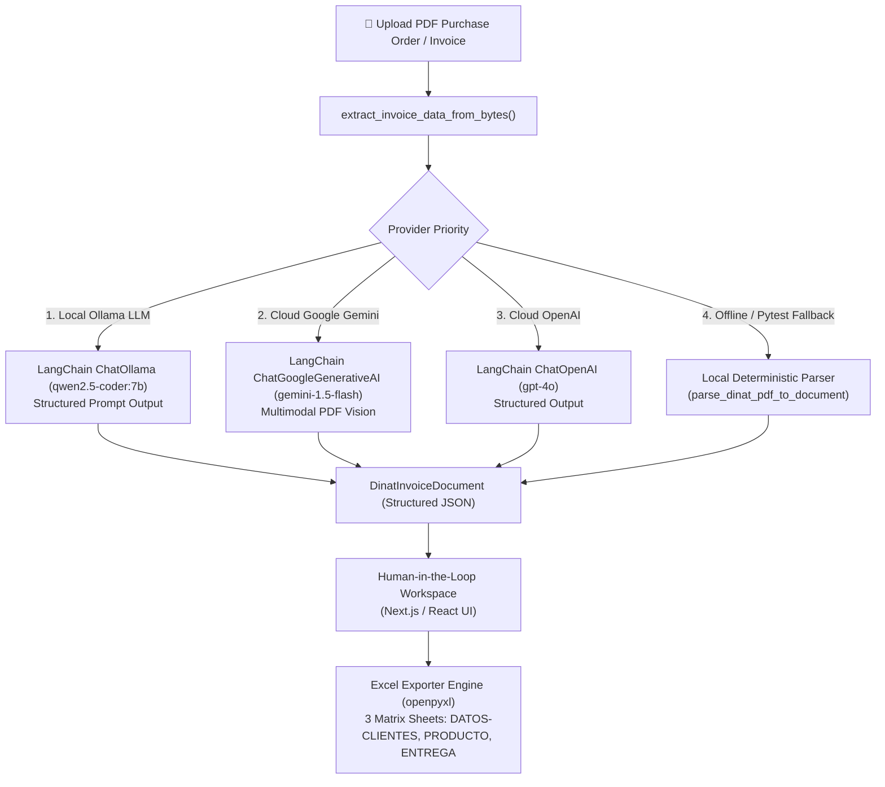

# PDF Data Extractor Desktop App

An enterprise-grade desktop application for extracting structured data from PDF purchase orders and invoices using Multimodal & Local LLMs (**LangChain + Ollama Qwen 2.5 Coder / Google Gemini / OpenAI / Local Deterministic Fallback**), reviewing & editing extracted data in a Human-in-the-Loop workspace, and generating or appending rows to Excel files (`.xlsx`).

---

## 🏗️ Architecture & Multi-LLM Engine

The system features a flexible, multi-provider architecture managed via **LangChain** and Pydantic structured output models:



### Supported Extraction Engines:
1. **Local Ollama (Recommended for Privacy & Zero Cost)**: Powered by `langchain-ollama` running `qwen2.5-coder:7b`. Fast local inference with zero token costs and zero external cloud dependency.
2. **Google Gemini (Cloud Multimodal)**: Powered by `langchain-google-genai` (`gemini-1.5-flash`) for direct multimodal document analysis.
3. **OpenAI (Cloud LLM)**: Powered by `langchain-openai` (`gpt-4o`) with strict Pydantic JSON schema enforcement.
4. **Local Deterministic Fallback**: A fast, zero-dependency regex and rule parser for offline execution and fast CI unit testing.

---

## 🛠️ Tech Stack

- **Backend**: Python 3.10+, FastAPI, LangChain, `langchain-ollama`, `langchain-google-genai`, `langchain-openai`, Pydantic V2, OpenPyXL, PyPDF
- **Frontend**: Next.js 14, React 18, Tailwind CSS, Lucide Icons
- **Desktop Container**: Electron (or standard local browser execution)
- **Local AI Runtime**: Ollama (`qwen2.5-coder:7b`)
- **Testing**: Pytest (Full suite with unit tests, API tests, Exporter tests, and live Ollama tests)

---

## 📋 Prerequisites

Before running the application, make sure you have the following installed on your local machine:

1. **Python 3.10+** (Verify with `python --version`)
2. **Node.js 18+ or 20+** (Verify with `node --version`)
3. **Git**
4. **Ollama** (Optional for local AI, download from [ollama.com](https://ollama.com))

---

## 🚀 How to Run the App (Local Environment)

To run the full stack locally, open **two separate terminal windows** (or three if launching Electron).

### Terminal 1: FastAPI Python Backend

```bash
# 1. Navigate to the backend directory
cd c:\dev\agentic\backend

# 2. Create a virtual environment (optional but recommended)
python -m venv venv

# 3. Activate virtual environment (Windows PowerShell)
.\venv\Scripts\Activate.ps1

# (On Linux / macOS use: source venv/bin/activate)

# 4. Install backend dependencies
pip install -r requirements.txt

# 5. Start the FastAPI backend server
python main.py
```

> **API Server URL**: `http://localhost:8000`  
> **Interactive Swagger Docs**: `http://localhost:8000/docs`

---

### Terminal 2: Next.js / React Frontend

```bash
# 1. Navigate to the frontend directory
cd c:\dev\agentic\frontend

# 2. Install frontend dependencies
npm install

# 3. Start the Next.js development server
npm run dev
```

> **Web Application URL**: `http://localhost:3000`

---

### Terminal 3 (Optional): Launch Electron Container

```bash
# Navigate to the project root directory
cd c:\dev\agentic

# Launch Electron desktop wrapper (requires Terminal 1 and Terminal 2 running in dev mode)
npx electron electron/main.js
```

---

## 🔑 LLM Provider Configuration (`backend/.env`)

Create a `.env` file inside the `backend/` directory to configure your preferred LLM provider:

### Option 1: Local Ollama (Qwen 2.5 Coder 7B) - *Recommended*
1. Pull the model in Ollama:
   ```bash
   ollama run qwen2.5-coder:7b
   ```
2. Configure `backend/.env`:
   ```env
   USE_OLLAMA=true
   OLLAMA_MODEL=qwen2.5-coder:7b
   OLLAMA_BASE_URL=http://localhost:11434
   ```

### Option 2: Google Gemini (Cloud Multimodal)
```env
GEMINI_API_KEY=your_gemini_api_key_here
```

### Option 3: OpenAI (Cloud)
```env
OPENAI_API_KEY=your_openai_api_key_here
```

### Option 4: Smart Local Fallback
If no environment variables are set, the app automatically runs in deterministic local mode with zero external network dependencies.

---

## 🧪 Running Automated Tests

### 1. Run Standard Backend Pytest Suite
Runs all unit tests, API tests, exporter tests, and extraction tests across test files in `archivos_prueba/`:
```bash
cd c:\dev\agentic
python -m pytest backend/tests/test_api.py backend/tests/test_exporter.py backend/tests/test_extractor_langchain.py backend/tests/test_archivos_prueba.py -v
```

### 2. Run Live Ollama LLM Test Suite
Tests extraction directly against your local Ollama `qwen2.5-coder:7b` instance:
```bash
python -m pytest backend/tests/test_ollama_extractor.py -v
```

### 3. Run Frontend Next.js Production Build Validation
```bash
cd c:\dev\agentic\frontend
npm run build
```

---

## 📖 Application User Guide

1. **Step 1: Upload PDF (`1. Cargar PDF`)**:
   - Drag & drop a purchase order or invoice PDF into the dropzone, or click **Seleccionar archivo**.
   - The system validates the PDF structure and invokes the selected LangChain / Local extraction pipeline.

2. **Step 2: Human-in-the-Loop Review (`3. Revisar y editar datos`)**:
   - Inspect the extracted data across the 6 collapsible document sections:
     - **Encabezado y Datos del Proveedor** (Order #, Issue Date, Vendor RTN, Brand)
     - **Datos del Cliente y Geolocalización** (Client Name, Store Code, Lat/Long coordinates)
     - **Detalle de Productos** (Editable line items table with automatic line total recalculations)
     - **Resumen y Totales Financieros** (Taxable Subtotal, 15% ISV tax, Grand Total)
     - **Transporte y Logística** (Driver Name, Employee ID, Vehicle Plate)
     - **Firmas y Autorizaciones** (Dispatched by, Received by, Authorized by)
   - Click **Ver JSON** to view or copy the raw JSON schema.
   - Click **Validar datos** when review is complete.

3. **Step 3: Ready for Production (`2. Listo para producción`)**:
   - Review the summary of the validated document.
   - Set the destination Excel file path (`.xlsx`).
   - Select the production action:
     - **Append (agregar al final)**: Appends new data rows to an existing Excel workbook sheet.
     - **Crear nuevo archivo**: Creates a brand new formatted Excel file.
   - Click **Confirmar y generar Excel** to save.

